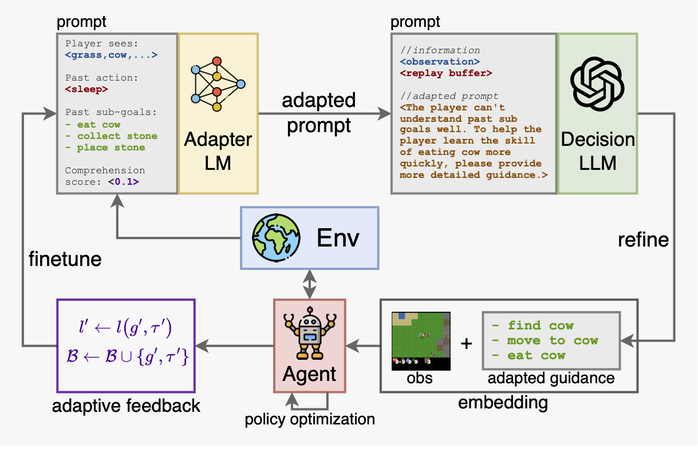

# 📄 AdaRefiner: Refining Decisions of Language Models with Adaptive Feedback

The official repository of our [[Paper]](https://aclanthology.org/2024.findings-naacl.50.pdf) at **NAACL 2024**.



*To reproduce the results of AdaRefiner, please follow the instructions below*.

## Installation & Preparation

1. Clone this repository and navigate to LLaVA folder

```bash
git clone https://github.com/PKU-RL/AdaRefiner.git
cd AdaRefiner
```

2. Install Package

```bash
conda create -n AdaRefiner python=3.10 -y
conda activate AdaRefiner
pip install --upgrade pip
pip install -r requirements.txt
```

3. Prepare models and configs

- You need to first download the Llama-2-7b-chat-hf model weights following [https://huggingface.co/meta-llama/Llama-2-7b-chat-hf](https://huggingface.co/meta-llama/Llama-2-7b-chat-hf). 
- After this, modify the following variables in `utils.py`:

```python
API_KEY = '' # Your OpenAI API key
LLM_PATH = '' # Path to the LLM model (Llama-2-7b-chat-hf)
GPT_MODEL = 'gpt-4' # GPT model name
QUERY_INTERVAL = 100 # Query interval for LLMs
DATA_PATH = './data' # Data path for SFT
```

## Training

To train the AdaRefiner from scratch, first modify the following paths in `sft.py`.

```python
model_path = '' # path to the LLM to be finetuned
save_path = '' # path to save the finetuned model
```

In the first stage, the `model_path` should be the path to the original `Llama-2-7b-chat-hf` model. In the following stages, the `model_path` should be changed to the finetuned model from the previous stage (*ie*, the model in the `save_path`).

Then repeat the following steps to complete the multi-stage training:

1. Train the policy and collect feedback data. (You may change the `max_train_steps` to a larger number for better performance. In our paper, we take 5 stages.)

```python
python train.py --max_train_steps=1000000
```

2. Modify the `model_path` and `save_path` in `sft.py` as described above.

3. Finetune the Adapter LM with the collected feedback data.

```python
python sft.py
```

## Test with the trained models

To test with the final models, run `python test.py`.

## Acknowledgements

Parts of the code are based on the [crafter](https://github.com/danijar/crafter) and [stable-baselines3](https://github.com/DLR-RM/stable-baselines3) repository.

## Citation

If you find our work useful in your research and would like to cite our project, please use the following citation:

```latex
@inproceedings{zhang-lu-2024-adarefiner,
    title = {{A}da{R}efiner: Refining Decisions of Language Models with Adaptive Feedback},
    author = {Zhang, Wanpeng and Lu, Zongqing},
    booktitle = {Findings of the Association for Computational Linguistics: NAACL 2024},
    month = {jun},
    year = {2024},
    publisher = {Association for Computational Linguistics},
    url = {https://aclanthology.org/2024.findings-naacl.50},
    pages = {782--799}
}
```